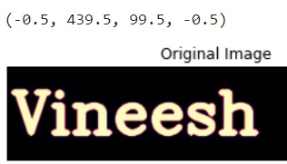
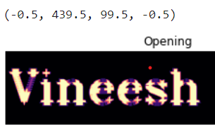
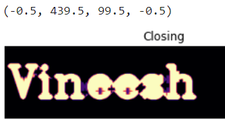

# Opening-and-Closing

## Aim
To implement Opening and Closing using Python and OpenCV.

## Software Required
1. Anaconda - Python 3.7
2. OpenCV
## Algorithm:
### Step1:
Import the necessary packages.
<br>


### Step2:
Create the text image using cv2.putText.
<br>

### Step3:
Then create the structuring element for opening and closing.
<br>

### Step4:
Apply erosion and dilation using cv2.MORPH_OPEN and cv2.MORPH_CLOSE.
<br>

### Step5:
Plot the images using plt.imshow.
<br>

 
## Program:

``` Python
### Developed by : Vineesh.M
### Register Number : 212221230122.
# Import the necessary packages
import cv2
import numpy as np
import matplotlib.pyplot as plt

# Create the Text using cv2.putText
text_image = np.zeros((100,440),dtype = 'uint8')
font = cv2.FONT_HERSHEY_SIMPLEX = 3
cv2.putText(text_image,"Vineesh",(5,70),font,2,(255),5,cv2.LINE_AA)
plt.title("Original Image")
plt.imshow(text_image,'magma')
plt.axis('off')

# Create the structuring element
kernel = cv2.getStructuringElement(cv2.MORPH_CROSS,(9,9))

# Use Opening operation
image1=cv2.morphologyEx(text_image,cv2.MORPH_OPEN,kernel)
plt.title("Opening")
plt.imshow(image1,'magma')
plt.axis('off')

# Use Closing Operation
image2=cv2.morphologyEx(text_image,cv2.MORPH_CLOSE,kernel)
plt.title("Closing")
plt.imshow(image2,'magma')
plt.axis('off')

```
## Output:

### Display the input Image:

<br>
<br>
<br>
<br>
<br>
<br>

### Display the result of Opening:

<br>
<br>
<br>
<br>
<br>
<br>

### Display the result of Closing:

<br>
<br>
<br>
<br>
<br>
<br>

## Result
Thus the Opening and Closing operation is used in the image using python and OpenCV.